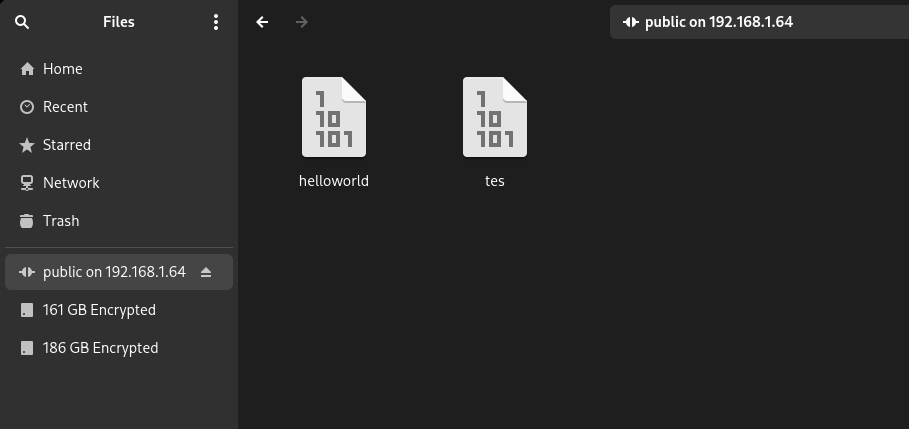
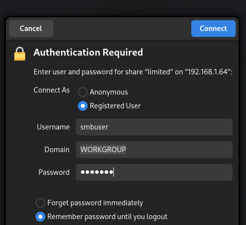
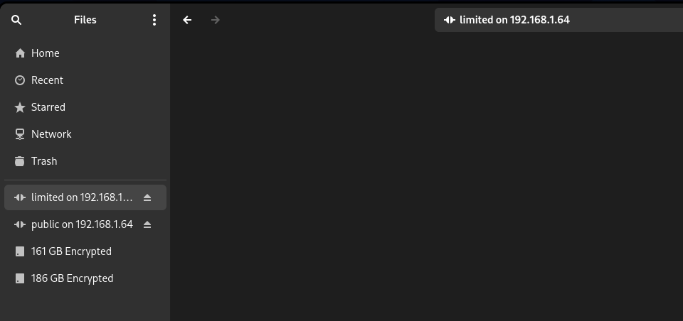
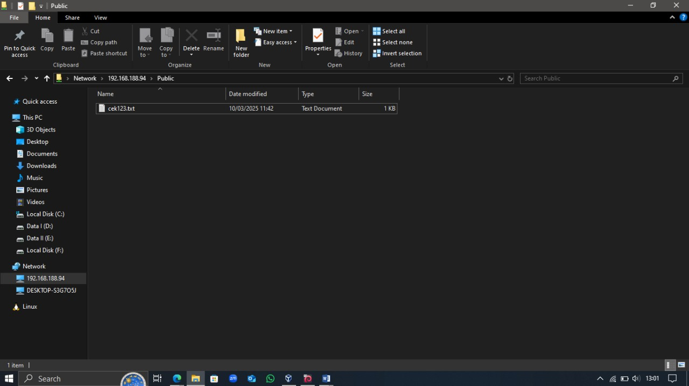

---

<p align="right">
    SURABAYA <br> 04 DESEMBER 2024
</p> <br>

<h1 align="center"><ins>LAPORAN RESMI</ins></h1>
<h3 align="center"><em>"Tugas 3 Mereview Materi Praktikum"</em></h3>
<h3 align="center">Mata Kuliah Workshop Administrasi Jaringan</h3>

<p align="center">
<br>
</p>

<p align="center">
Nama Dosen Pengampu : <br> 
Bapak Dr Ferry Astika Saputra ST, M.Sc <br><br>
Dikerjakan Oleh : <br>
</p>

<p>
&emsp;&emsp;&emsp;&emsp;&emsp;&emsp;&emsp;&emsp;&emsp;&emsp;&emsp;&emsp;&emsp;&emsp;&emsp;&emsp;Nama&emsp;&nbsp; : Nanda Ahmad Zidan <br>
&emsp;&emsp;&emsp;&emsp;&emsp;&emsp;&emsp;&emsp;&emsp;&emsp;&emsp;&emsp;&emsp;&emsp;&emsp;&emsp;NRP&emsp;&emsp;&nbsp;: 3123600013 <br>
&emsp;&emsp;&emsp;&emsp;&emsp;&emsp;&emsp;&emsp;&emsp;&emsp;&emsp;&emsp;&emsp;&emsp;&emsp;&emsp;Kelas&emsp;&emsp;: 2 D4 IT A <br>
<br>
</p>

<p align="center">
Tahun Pelajaran 2024/2025 <br>
<strong>POLITEKNIK ELEKTRONIKA NEGERI SURABAYA</strong>
</p>

---

# DAFTAR ISI

[DAFTAR ISI](#daftar-isi)<br>
[TUJUAN PEMBELAJARAN](#tujuan-pembelajaran)<br>
[SOAL](#soal)<br>
[HASIL REVIEW](#c-hasil-review)<br>
A. [Instalasi NTP Client](#1-instalasi-ntp-client)<br>
B. [Instalasi dan Konfigurasi Samba](#b-instalasi-dan-konfigurasi-samba)<br>
C. [Rangkuman Debian 12 Sysadmin (Package Management)](#c-rangkuman-debian-12-sysadmin-package-management)

<p align="center">i</p>

---

## TUJUAN PEMBELAJARAN
1. Memahami apa itu proses
2. Memahami bagaimana cara melihat list proses yang berjalan di Linux
3. Memahami cara mematikan proses yang tak diinginkan
4. Memahami penamaan file dalam Linux
5. Memahami struktur file dalam Linux

## SOAL
Download / clone / kunjungi materi dari [Materi Linux](https://github.com/ferryastika/unix-and-linux-sysadmin-notes), tak lupa lakukan / setting dulu docker agar bisa mencoba de kemudian lakukan ini :<br>
A. Instalasi NTP Client 
  1. Install dan konfigurasi NTP client agar host anda mempunyai Waktu yang sinkron dengan NTP server di Indonesia.
  2. Nama NTP server yang harus dirujuk adalah ntp server Indonesia Referensi :
    - https://www.server-world.info/en/note?os=Debian_12&p=ntp&f=1
    - https://www.ntppool.org/en/zone/id Package terkait : ntp ntpssec

B. Instalasi dan konfigurasi Samba
  1. Membuat public shared folder . Folder tersebut harus bisa diakses melalui Windows Client dan Linux Client via file manager
  2. Membuat limited shared Folder.
  3. Akses ke folder Share dari CLI client Referensi :
     - https://www.server-world.info/en/note?os=Debian_12&p=samba&f=1
     - Package terkait : samba, smbclient, cifs-tools

C. Buat rangkuman tentang package management. 
  - Bahan ada di Materi ethol debian 12 sysadmin) Di tiap nomor buat langkah-langkah instalasi, konfigurasi dan hasil (ouput) dari perintah-perintah terkait yang memastikan layanan  dapat digunakan dengan baik 

<p align="center">1</p>

---
## HASIL REVIEW

### A. Instalasi NTP Client
1. Kita instal terlebih dulu dengan menggunakan perintah ini di debian linux :
   ```bash
   zidan-3123600013:~$ sudo apt update                -->untuk mengupdate jikalau ada pembaruan di linux
   zidan-3123600013:~$ sudo apt install ntp -y        -->untuk menginstall ntp

   # bisa juga menggunakan ntpsec
   zidan-3123600013:~$ sudo apt install ntpsec -y     -->untuk menginstall ntpsec
   ```
2. Konfigurasi ntp
   ```bash
   # pertama kita ubah dulu server yang dipantau oleh ntp
   zidan-3123600013:~$ sudo nano /etc/ntp.conf

   # atau /etc/ntpsec/ntp.conf jika menggunakan ntpsec
   zidan-3123600013:~$ sudo nano /etc/ntpsec/ntp.conf
   ```
   kemudian kita tambahkan server yang kita mau, kali ini di indonesia maka scroll hingga menemukan ini dan kita tambahkan ini :
   # pool 2.debian.pool.ntp.org iburst
   # pool 3.debian.pool.ntp.org iburst
   ...
   server 0.id.pool.ntp.org iburst
   server 1.id.pool.ntp.org iburst
   server 2.id.pool.ntp.org iburst
   server 3.id.pool.ntp.org iburst
   ... 
   # Access control configuration; see /usr/share/doc/ntpsec-doc/html/accopt.html
   # for details.

   Jika sudah disimpan dan jalankan perintah ini :
   ```bash
   zidan-3123600013:~$ sudo systemctl restart ntp
   zidan-3123600013:~$ sudo systemctl enable ntp
   zidan-3123600013:~$ sudo systemctl status ntp
    ntpsec.service - Network Time Service
 	Loaded: loaded (/lib/systemd/system/ntpsec.service; enabled; preset: enabled)
 	Active: active (running) since Mon 2025-03-10 18:21:29 WIB; 10h ago
   	Docs: man:ntpd(8)
	Process: 4629 ExecStart=/usr/libexec/ntpsec/ntp-systemd-wrapper (code=exited, status=0/SUCCESS)
   Main PID: 4632 (ntpd)
  	Tasks: 1 (limit: 2293)
 	Memory: 10.6M
    	CPU: 42ms
 	CGroup: /system.slice/ntpsec.service
         	└─4632 /usr/sbin/ntpd -p /run/ntpd.pid -c /etc/ntpsec/ntp.conf -g -N -u ntpsec:ntpsec
   Mar 10 18:21:34 vbox ntpd[4632]: DNS: dns_probe: 2.id.pool.ntp.org, cast_flags:1, flags:20901
   Mar 10 18:21:34 vbox ntpd[4632]: DNS: dns_check: processing 2.id.pool.ntp.org, 1, 20901
   Mar 10 18:21:34 vbox ntpd[4632]: DNS: Server taking: 116.12.47.30
   Mar 10 18:21:34 vbox ntpd[4632]: DNS: dns_take_status: 2.id.pool.ntp.org=>good, 0
   Mar 10 18:21:35 vbox ntpd[4632]: DNS: dns_probe: 1.id.pool.ntp.org, cast_flags:1, flags:20901
   Mar 10 18:21:35 vbox ntpd[4632]: DNS: dns_check: processing 1.id.pool.ntp.org, 1, 20901
   Mar 10 18:21:35 vbox ntpd[4632]: DNS: Server taking: 202.65.114.202
   Mar 10 18:21:35 vbox ntpd[4632]: DNS: dns_take_status: 1.id.pool.ntp.org=>good, 0
   Mar 11 04:32:50 vbox ntpd[4632]: CLOCK: time stepped by 36669.858416
   Mar 11 04:32:50 vbox ntpd[4632]: INIT: MRU 10922 entries, 13 hash bits, 65536 bytes
   ~

   ```
   
   Sehingga bila kita ketik perintah ini maka akan nampak server indonesia yang ada di sekitar kita dan tersinkronisasi
   ```bash
   zidan-3123600013@vbox:~$ ntpq -p
 	remote                              	refid  	st t when poll reach   delay   offset   jitter
   ======================================================================================================
   ns1.ads.net.id                     	.STEP.      	16 u	-   64	0   0.0000   0.0000   0.0001
   ns3.ads.net.id                     	.STEP.      	16 u	-   64	0   0.0000   0.0000   0.0001
   27.54.117.72                       	.STEP.      	16 u	-   64	0   0.0000   0.0000   0.0001
   2.ntp.maxindo.net.id               	.STEP.      	16 u	-   64	0   0.0000   0.0000   0.0001
   ```

<p align="center">1</p>

---


### B. Instalasi dan Konfigurasi Samba
1. Install Paket Samba
   lakukan perintah ini agar menginstall samba :
   ```bash
   zidan-3123600013@vbox:~$ sudo apt update
   zidan-3123600013@vbox:~$ sudo apt install samba smbclient cifs-utils -y
   ```
2. Buat public shared folder / directory
   Pertama-tama kita buat folder terlebih dahulu di dalam direktori /srv/samba/ (nama folder/direktorinya terserah). Folder ini nantinya akan digunakan untuk mneruh file yang kita share/bagikan.
   ```bash
   zidan-3123600013@vbox:~$ sudo mkdir -p /srv/samba/public
   zidan-3123600013@vbox:~$ sudo chmod 777 /srv/samba/public
   zidan-3123600013@vbox:~$ sudo chown nobody:nogroup /srv/samba/public
   ```
   
   Kemudian edit file berikut dan ikuti perintah ini :
   ```bash
   zidan-3123600013@vbox:~$ sudo nano /etc/samba/smb.conf
   ```

   lalu tambahkan ini pada bagian terakhir (di situ public adalah nama folder yang nantinya akan tertera pada saat kita menampilkannya di client):
   ```bash
   ....
   [Public]
   path = /srv/samba/public
   browseable = yes
   writable = yes
   guest ok = yes
   create mask = 0777
   directory mask = 0777
   ```

   Kemudian simpan dan restart ulang smb/samba nya, serta cek statusnya :
   ```bash
   zidan-3123600013@vbox:~$ sudo systemctl restart smb
   zidan-3123600013@vbox:~$ sudo systemctl status smb
   [sudo] password for zidan-3123600013:
   ● smbd.service - Samba SMB Daemon
 	Loaded: loaded (/lib/systemd/system/smbd.service; enabled; preset: enabled)
 	Active: active (running) since Tue 2025-03-11 20:07:14 WIB; 1h 14min ago
   	Docs: man:smbd(8)
         	man:samba(7)
         	man:smb.conf(5)
	Process: 10820 ExecCondition=/usr/share/samba/is-configured smb (code=exited, status=0/SUCCESS)
	Process: 10823 ExecStartPre=/usr/share/samba/update-apparmor-samba-profile (code=exited, status=0/SUCCESS)
   Main PID: 10833 (smbd)
 	Status: "smbd: ready to serve connections..."
  	Tasks: 5 (limit: 2293)
 	Memory: 35.9M
    	CPU: 672ms
 	CGroup: /system.slice/smbd.service
         	├─10833 /usr/sbin/smbd --foreground --no-process-group
         	├─10835 /usr/sbin/smbd --foreground --no-process-group
         	├─10836 /usr/sbin/smbd --foreground --no-process-group
         	├─11200 /usr/sbin/smbd --foreground --no-process-group
         	└─11218 /usr/sbin/smbd --foreground --no-process-group
   Mar 11 20:07:14 vbox systemd[1]: Starting smbd.service - Samba SMB Daemon...
   Mar 11 20:07:14 vbox systemd[1]: Started smbd.service - Samba SMB Daemon.
   Mar 11 20:11:52 vbox smbd[10949]: pam_unix(samba:session): session closed for user nobody
   Mar 11 20:24:00 vbox smbd[11218]: pam_unix(samba:session): session opened for user smbuser(uid=1001) by (uid=0)
   ```

<p align="center">2</p>

---

   
4. Buat limited shared folder / directory
   Pertama-tama kita buat folder juga sama seperti public shared folder tadi, bedanya ada pada bagaimana folder tersebut diakses / permission-nya,
   ```bash
   zidan-3123600013@vbox:~$ sudo mkdir -p /srv/samba/limited
   zidan-3123600013@vbox:~$ sudo chmod 770 /srv/samba/limited
   zidan-3123600013@vbox:~$ sudo chown nobody:sambashare /srv/samba/limited
   ```

   Tak lupa juga kita buat user baru yang hanya bisa diakses client dan juga kita buat user itu memiliki group agar server juga bisa mengisi/membuat file di dalamnya :
   ```bash
   zidan-3123600013@vbox:~$ sudo useradd -M -s /sbin/nologin smbuser
   [sudo] password for zidan-3123600013:
   New password:
   Retype new password:
   passwd: password updated successfully

   zidan-3123600013@vbox:~$ sudo smbpasswd -a smbuser
   New SMB password:
   Retype new SMB password:

   zidan-3123600013@vbox:~$ sudo smbpasswd -e smbuser
   Enabled user smbuser.
   
   zidan-3123600013@vbox:~$ sudo usermod -aG sambashare smbuser

   # tak lupa kita buat agar user kita satu group dengan smbuser
   zidan-3123600013@vbox:~$ sudo usermod -aG sambashare zidan-3123600013
   ```

   Kemudian edit file smb.conf lagi :
   ```bash
   zidan-3123600013@vbox:~$ sudo nano /etc/samba/smb.conf
   ```
   
   lalu tambahkan ini pada bagian terakhir (di situ Limited adalah nama folder yang nantinya akan tertera pada saat kita menampilkannya di client):
   ```bash
   [Limited]
   path = /srv/samba/limited
   browseable = yes
   writable = yes
   guest ok = no
   valid users = @sambashare
   create mask = 0660
   directory mask = 0770
   ```

   
   Kemudian simpan dan restart ulang smb/samba nya, serta cek statusnya :
   ```bash
   zidan-3123600013@vbox:~$ sudo systemctl restart smb
   zidan-3123600013@vbox:~$ sudo systemctl status smb
   [sudo] password for zidan-3123600013:
   ● smbd.service - Samba SMB Daemon
 	Loaded: loaded (/lib/systemd/system/smbd.service; enabled; preset: enabled)
 	Active: active (running) since Tue 2025-03-11 20:07:14 WIB; 1h 14min ago
   	Docs: man:smbd(8)
         	man:samba(7)
         	man:smb.conf(5)
	Process: 10820 ExecCondition=/usr/share/samba/is-configured smb (code=exited, status=0/SUCCESS)
	Process: 10823 ExecStartPre=/usr/share/samba/update-apparmor-samba-profile (code=exited, status=0/SUCCESS)
   Main PID: 10833 (smbd)
 	Status: "smbd: ready to serve connections..."
  	Tasks: 5 (limit: 2293)
 	Memory: 35.9M
    	CPU: 672ms
 	CGroup: /system.slice/smbd.service
         	├─10833 /usr/sbin/smbd --foreground --no-process-group
         	├─10835 /usr/sbin/smbd --foreground --no-process-group
         	├─10836 /usr/sbin/smbd --foreground --no-process-group
         	├─11200 /usr/sbin/smbd --foreground --no-process-group
         	└─11218 /usr/sbin/smbd --foreground --no-process-group
   Mar 11 20:07:14 vbox systemd[1]: Starting smbd.service - Samba SMB Daemon...
   Mar 11 20:07:14 vbox systemd[1]: Started smbd.service - Samba SMB Daemon.
   Mar 11 20:11:52 vbox smbd[10949]: pam_unix(samba:session): session closed for user nobody
   Mar 11 20:24:00 vbox smbd[11218]: pam_unix(samba:session): session opened for user smbuser(uid=1001) by (uid=0)
   ```
   
6. Gunakan file manajer untuk mengakses shared folder tersebut
   Pertama kita cek dulu pada server samba yang kita buat di 
   - Untuk mengakses samba dari file manager kita hanya perlu memasukkan alamat ipnya beserta nama folder tadi yang sudah kita masukkan ke smb.conf.
   - Untuk linux sendiri harus didahului dengan menginstall gvfs-smb guna mengakses smb di dalam file manager. Untuk windows tidak perlu menginstall apa-apa.
   Berikut tampilannya di linux (Kita masukkan smb://192.168.1.64/<nama_direktori>).
   "Public"
   
   
   "Limited"<br>
   <br>
   <br>
   
   Berikut tampilannya di windows (Kita masukkan \\192.168.188.94\<nama_direktori>)
   

<p align="center">3</p>

---


8. Gunakan CLI (khusus untuk client linux)
   Pertama kita tampilkan dulu apa saja direktori yang ada:
   ```bash
   > smbclient -L 192.168.1.64 -N

	Sharename       Type      Comment
	---------       ----      -------
	print$          Disk      Printer Drivers
	Public          Disk
	Limited         Disk
	IPC$            IPC       IPC Service (Samba 4.17.12-Debian)
	nobody          Disk      Home Directories
   ```
   
   Ini adalah tampilan ketika mengakses public folder
   ```bash
   # untuk masuk ke direktori yang dituju gunakan ini :
   > smbclient //192.168.188.94/Public -N
   Try "help" to get a list of possible commands.
   smb: \> ls
   .                                   D        0  Mon Mar 10 14:36:02 2025
   ..                                  D        0  Mon Mar 10 14:33:53 2025
   tes                                 N       11  Mon Mar 10 14:35:59 2025

		19480400 blocks of size 1024. 12861968 blocks available
   # kita coba untuk mendownload file tes tersebut dari server samba yang kita buat (gunakan perintah get / mget jika banyak file)
   > smb: \> get tes
   getting file \tes of size 11 as tes (5.4 KiloBytes/sec) (average 5.4 KiloBytes/sec)
   > smb: \> exit

   # kita coba untuk mengupload file yang sudah kita buat di home kita sebelumnya (gunakan perintah put / mput jika banyak file)
   > nano helloworld
   > smbclient //192.168.188.94/Public -N
   > smb: \> put helloworld						
   putting file helloworld as \helloworld (2.9 kb/s) (average 2.9 kb/s)
   ```
   
   Ini adalah tampilan ketika mengakses limited folder
   ```bash
   # fungsi sama untuk mengecek list direktori
   > smbclient -L //192.168.188.94/Limited -U smbuser
   > smbclient //192.168.188.94/Limited -U smbuser
   Password for [WORKGROUP\smbuser]:
   session setup failed: NT_STATUS_LOGON_FAILURE
   > smbclient //192.168.188.94/Limited -U smbuser
   Password for [WORKGROUP\smbuser]:
   Try "help" to get a list of possible commands.
   smb: \> ls
   .                                   D        0  Mon Mar 10 10:59:24 2025
   ..                                  D        0  Mon Mar 10 14:33:53 2025

		19480400 blocks of size 1024. 12862464 blocks available\
   smb: \> exit
   ```
   
<p align="center">4</p>

---


### C. Rangkuman Debian 12 Sysadmin (Package Management)

### **8.1 Sumber Perangkat Lunak**
Debian GNU/Linux menggunakan sistem repositori untuk mendistribusikan aplikasi. Repositori ini memungkinkan pengguna untuk mengelola dan memperbarui sistem dengan mudah tanpa harus mengunjungi situs web masing-masing perangkat lunak. Repositori Debian menyimpan semua paket perangkat lunak yang diperlukan, baik yang berupa biner (sudah dikompilasi) maupun sumber kode (source code).

#### **8.1.1 File sources.list**
File `/etc/apt/sources.list` adalah file konfigurasi yang berisi daftar repositori yang digunakan oleh sistem Debian. File ini menentukan dari mana paket-paket perangkat lunak akan diunduh. Setiap baris dalam file ini dimulai dengan `deb` untuk repositori biner atau `deb-src` untuk repositori sumber kode. Contoh isi file `sources.list` pada Debian 12 (Bookworm):

```bash
zidan-3123600013@vbox:~$ sudo nano /etc/apt/sources.list
```

Misal contoh untuk repository yang bisa kita tambahkan
```plaintext
deb http://deb.debian.org/debian/ bookworm main non-free-firmware
deb-src http://deb.debian.org/debian/ bookworm main non-free-firmware
deb http://security.debian.org/debian-security bookworm-security main non-free-firmware
deb-src http://security.debian.org/debian-security bookworm-security main non-free-firmware
deb http://deb.debian.org/debian/ bookworm-updates main non-free-firmware
deb-src http://deb.debian.org/debian/ bookworm-updates main non-free-firmware
```

- **deb**: Menunjukkan repositori biner (paket yang sudah dikompilasi).
- **deb-src**: Menunjukkan repositori sumber kode (kode program yang digunakan untuk mengompilasi perangkat lunak).
- **bookworm**: Merupakan nama versi Debian yang digunakan (dalam hal ini Debian 12).
- **main**, **non-free-firmware**: Merupakan bagian dari repositori yang menyediakan paket-paket tertentu.

Mengapa menggunakan nama "bookworm" dan bukan "stable"? Karena "bookworm" adalah nama spesifik dari versi Debian 12, sedangkan "stable" adalah istilah generik untuk versi stabil saat ini. Ketika Debian 13 (Trixie) dirilis, Debian 12 akan menjadi "oldstable".

#### **8.1.2 Tentang Repositori, Cabang, dan Bagian/Komponen**
Repositori Debian dibagi menjadi beberapa cabang dan bagian. Cabang utama yang digunakan adalah **stable**, **testing**, dan **unstable**. Selain itu, ada juga bagian/komponen dalam repositori yang menentukan jenis perangkat lunak yang disediakan:

- **main**: Berisi perangkat lunak yang sepenuhnya bebas dan mematuhi DFSG (Debian Free Software Guidelines).
- **non-free-firmware**: Berisi firmware non-bebas yang diperlukan untuk beberapa perangkat keras.
- **contrib**: Berisi perangkat lunak bebas yang memiliki dependensi non-bebas.
- **non-free**: Berisi perangkat lunak yang tidak mematuhi DFSG.

Hanya paket dalam bagian **main** yang sepenuhnya didukung oleh proyek Debian. Paket dalam **contrib**, **non-free**, dan **non-free-firmware** mungkin memerlukan driver atau komponen non-bebas untuk berfungsi dengan baik.

#### **8.1.3 Paket Backport**
Backport adalah mekanisme yang memungkinkan versi terbaru dari aplikasi yang ada di repositori pengembangan Debian untuk dipindahkan ke versi "stable". Misalnya, jika ada versi terbaru dari LibreOffice di repositori pengembangan, Debian dapat "membawa kembali" (backport) versi tersebut ke repositori stable. Repositori backport tidak diaktifkan secara default, tetapi tidak berisiko tinggi karena repositori reguler memiliki prioritas lebih tinggi saat memperbarui sistem.

#### **8.1.4 Memodifikasi Repositori**
Anda dapat memodifikasi repositori dengan mengedit file `sources.list`. Misalnya, jika Anda memerlukan driver non-bebas untuk perangkat keras tertentu, Anda dapat menambahkan bagian **non-free** atau **non-free-firmware** ke file tersebut. Setelah memodifikasi file, Anda perlu memperbarui daftar paket dengan perintah `apt update`.


<p align="center">5</p>

---


### **8.2 APT di Terminal**
APT (Advanced Package Tool) adalah alat utama untuk mengelola paket di Debian. APT memungkinkan Anda menginstal, memperbarui, dan menghapus paket dengan mudah melalui terminal.

#### **8.2.1 Perintah Pengguna untuk Mencari dan Menampilkan Informasi**
Perintah-perintah berikut dapat dijalankan sebagai pengguna biasa karena tidak memengaruhi sistem secara langsung:
- **`apt show foo`**: Menampilkan informasi detail tentang paket `foo`.
- **`apt search foo`**: Mencari paket yang sesuai dengan kata kunci `foo`.
- **`apt-cache policy foo`**: Menampilkan versi paket `foo` yang tersedia di repositori.

Contoh penggunaan :
```bash
zidan-3123600013@vbox:~$ apt search firefox
Sorting... Done
Full Text Search... Done
firefox-esr/stable 102.12.0esr-1~deb12u1 amd64
  Mozilla Firefox web browser - Extended Support Release (ESR)
```

#### **8.2.2 Perintah Mode Administrator untuk Pemeliharaan Sistem**
Perintah-perintah berikut memerlukan hak akses administrator (root) karena dapat memengaruhi sistem:
- **`apt update`**: Memperbarui metadata repositori (daftar paket yang tersedia).
- **`apt install foo`**: Menginstal paket `foo` beserta dependensinya.
- **`apt upgrade`**: Memperbarui semua paket yang terinstal ke versi terbaru.
- **`apt full-upgrade`**: Memperbarui paket dengan menambah atau menghapus paket lain jika diperlukan.
- **`apt remove foo`**: Menghapus paket `foo` tetapi menyimpan file konfigurasinya.
- **`apt purge foo`**: Menghapus paket `foo` beserta file konfigurasinya.
- **`apt autoremove`**: Menghapus paket yang tidak diperlukan lagi oleh sistem.

Contoh perintah all-in-one untuk memperbarui sistem:
```bash
zidan-3123600013@vbox:~$ sudo apt update && sudo apt upgrade
Get:1 http://deb.debian.org/debian bookworm InRelease [147 kB]
Get:2 http://security.debian.org/debian-security bookworm-security InRelease [48.0 kB]
...
Fetched 12.3 MB in 5s (2,456 kB/s)
Reading package lists... Done
Building dependency tree... Done
Reading state information... Done
123 packages can be upgraded. Run 'apt list --upgradable' to see them.
```

### **8.3 Software: Manajer Paket Sederhana**
**Software** adalah manajer paket grafis yang disederhanakan untuk Debian. Ini memungkinkan pengguna yang kurang familiar dengan terminal untuk mengelola aplikasi dengan mudah.


<p align="center">6</p>

---


#### **8.3.1 Mencari Aplikasi**
Anda dapat mencari aplikasi dengan mengetikkan nama aplikasi di kotak pencarian atau menjelajahi kategori yang tersedia, seperti **Explore**, **Installed**, dan **Updates**.

#### **8.3.2 Menginstal Aplikasi**
Untuk menginstal aplikasi, cukup klik pada aplikasi yang diinginkan dan tekan tombol "Install". Anda akan diminta memasukkan kata sandi administrator. Setelah instalasi selesai, aplikasi dapat langsung dijalankan.
Contoh menginstal aplikasi dengan software:
```bash
zidan-3123600013@vbox:~$ sudo apt install gnome-software
Reading package lists... Done
Building dependency tree... Done
Reading state information... Done
The following NEW packages will be installed:
  gnome-software
0 upgraded, 1 newly installed, 0 to remove and 0 not upgraded.
Need to get 1,234 kB of archives.
After this operation, 4,567 kB of additional disk space will be used.
Get:1 http://deb.debian.org/debian bookworm/main amd64 gnome-software amd64 3.38.1-2 [1,234 kB]
Fetched 1,234 kB in 2s (617 kB/s)
Selecting previously unselected package gnome-software.
(Reading database ... 123456 files and directories currently installed.)
Preparing to unpack .../gnome-software_3.38.1-2_amd64.deb ...
Unpacking gnome-software (3.38.1-2) ...
Setting up gnome-software (3.38.1-2) ...
```

#### **8.3.3 Menghapus Aplikasi**
Anda dapat menghapus aplikasi dari kategori **Installed** dengan mengklik tombol "Remove". Anda akan diminta konfirmasi sebelum aplikasi dihapus.

#### **8.3.4 Memperbarui Aplikasi**
Anda dapat memperbarui sistem dari bagian **Updates**. Jika ada pembaruan sistem operasi, Anda perlu me-restart sistem setelah pembaruan selesai.

#### **8.3.5 Memodifikasi Repositori Paket**
Anda dapat mengonfigurasi repositori secara grafis melalui menu **Repositories**. Di sini, Anda dapat menambahkan repositori **non-free** atau mengatur frekuensi pembaruan repositori.

#### **8.3.6 Pembaruan Otomatis dengan Software**
Anda dapat mengaktifkan pembaruan otomatis melalui menu **Update Preferences**. Ini memungkinkan sistem untuk secara otomatis mengunduh dan menginstal pembaruan di latar belakang.

Tentu, berikut adalah penjelasan lebih detail untuk sub bab **8.4 sampai 8.6** berdasarkan konten file yang diberikan:


<p align="center">7</p>

---


### **8.4 Discover: Manajer Paket KDE**
**Discover** adalah manajer paket yang dirancang khusus untuk lingkungan desktop KDE. Ini adalah antarmuka grafis yang memungkinkan pengguna KDE untuk mencari, menginstal, menghapus, dan memperbarui aplikasi dengan mudah. Discover juga memungkinkan pengguna untuk mengelola sumber perangkat lunak (repositori) dan menginstal add-ons untuk lingkungan Plasma.

#### **8.4.1 Mencari dan Menginstal dengan Discover**
Untuk mencari aplikasi, Anda dapat mengetikkan nama aplikasi di kotak pencarian atau menjelajahi kategori yang tersedia, seperti **Games**, **Graphics**, **Internet**, dan lainnya. Setelah menemukan aplikasi yang diinginkan, cukup klik tombol "Install" untuk memulai proses instalasi. Anda akan diminta memasukkan kata sandi administrator untuk mengonfirmasi instalasi.

Contoh menginstall plasma discover :
```bash
zidan-3123600013@vbox:~$ sudo apt install plasma-discover
Reading package lists... Done
Building dependency tree... Done
Reading state information... Done
The following NEW packages will be installed:
  plasma-discover
0 upgraded, 1 newly installed, 0 to remove and 0 not upgraded.
Need to get 1,234 kB of archives.
After this operation, 4,567 kB of additional disk space will be used.
Get:1 http://deb.debian.org/debian bookworm/main amd64 plasma-discover amd64 5.20.5-1 [1,234 kB]
Fetched 1,234 kB in 2s (617 kB/s)
Selecting previously unselected package plasma-discover.
(Reading database ... 123456 files and directories currently installed.)
Preparing to unpack .../plasma-discover_5.20.5-1_amd64.deb ...
Unpacking plasma-discover (5.20.5-1) ...
Setting up plasma-discover (5.20.5-1) ...
```

#### **8.4.2 Memperbarui Sistem dengan Discover**
Discover memiliki bagian khusus untuk pembaruan sistem. Di sini, Anda dapat melihat daftar pembaruan yang tersedia dan menginstalnya dengan satu klik. Jika ada pembaruan sistem operasi, Discover akan meminta Anda untuk me-restart sistem setelah pembaruan selesai.

#### **8.4.3 Mengelola Repositori dengan Discover**
Anda dapat mengelola repositori perangkat lunak melalui bagian **Settings** di Discover. Di sini, Anda dapat menambahkan atau menghapus repositori, serta mengatur prioritas repositori. Informasi repositori yang ditampilkan di Discover berasal dari file `/etc/apt/sources.list`.

#### **8.4.4 Menginstal Widget dan Add-ons Plasma**
Discover juga memungkinkan Anda untuk menginstal widget dan add-ons untuk lingkungan desktop Plasma. Anda dapat menemukan berbagai widget, tema, dan add-ons di bagian **Plasma Add-ons**. Ini memungkinkan Anda untuk menyesuaikan tampilan dan fungsi desktop KDE sesuai dengan preferensi Anda.


<p align="center">8</p>

---


### **8.5 Synaptic: Manajer Paket Komprehensif**
**Synaptic** adalah manajer paket grafis yang lebih komprehensif dibandingkan dengan **Software** atau **Discover**. Ini memberikan gambaran lengkap tentang semua paket yang tersedia di repositori Debian, baik yang sudah terinstal maupun yang belum. Synaptic sangat berguna untuk pengguna yang ingin memiliki kontrol penuh atas paket-paket yang terinstal di sistem mereka.

#### **8.5.1 Memperbarui Sistem dengan Synaptic**
Sebelum memperbarui sistem, Anda perlu memuat ulang daftar paket dengan mengklik tombol **Reload**. Setelah itu, Anda dapat menandai semua paket yang dapat diperbarui dengan mengklik **Mark All Upgrades**. Jika ada paket yang perlu diperbarui, Synaptic akan menampilkan daftar paket tersebut. Anda dapat mengonfirmasi dan menginstal pembaruan dengan mengklik **Apply**.

Contoh install dengan synaptic :
```bash
zidan-3123600013@vbox:~$ sudo apt install synaptic
Reading package lists... Done
Building dependency tree... Done
Reading state information... Done
The following NEW packages will be installed:
  synaptic
0 upgraded, 1 newly installed, 0 to remove and 0 not upgraded.
Need to get 1,234 kB of archives.
After this operation, 4,567 kB of additional disk space will be used.
Get:1 http://deb.debian.org/debian bookworm/main amd64 synaptic amd64 0.90.1 [1,234 kB]
Fetched 1,234 kB in 2s (617 kB/s)
Selecting previously unselected package synaptic.
(Reading database ... 123456 files and directories currently installed.)
Preparing to unpack .../synaptic_0.90.1_amd64.deb ...
Unpacking synaptic (0.90.1) ...
Setting up synaptic (0.90.1) ...
```

#### **8.5.2 Mencari Paket dengan Synaptic**
Synaptic memiliki fitur pencarian yang kuat. Anda dapat mencari paket berdasarkan nama atau deskripsi. Jika Anda tidak tahu nama paket yang Anda cari, Anda dapat menjelajahi paket berdasarkan kategori, seperti **Games**, **Development**, atau **System**.

#### **8.5.3 Menginstal Paket dengan Synaptic**
Untuk menginstal paket, cukup klik kanan pada paket yang diinginkan dan pilih **Mark for Installation**. Jika paket tersebut memiliki dependensi, Synaptic akan secara otomatis menambahkan dependensi yang diperlukan ke daftar instalasi. Setelah itu, klik **Apply** untuk memulai proses instalasi.

#### **8.5.4 Menghapus Paket dengan Synaptic**
Anda dapat menghapus paket dengan menandainya untuk dihapus (**Mark for Removal**) atau menghapus paket beserta file konfigurasinya (**Mark for Complete Removal**). Setelah menandai paket yang akan dihapus, klik **Apply** untuk memulai proses penghapusan.

#### **8.5.5 Membersihkan Paket yang Tidak Diperlukan**
Synaptic juga memungkinkan Anda untuk membersihkan paket yang tidak diperlukan lagi oleh sistem. Anda dapat menemukan paket-paket ini di kategori **Installed (Auto removable)**. Setelah menandai paket yang akan dihapus, klik **Apply** untuk membersihkannya dari sistem.

#### **8.5.6 Melihat Informasi Detail tentang Paket**
Synaptic menyediakan informasi detail tentang setiap paket, termasuk dependensi, file yang diinstal, dan ukuran paket. Anda dapat melihat informasi ini dengan mengklik kanan pada paket dan memilih **Properties**.


<p align="center">9</p>

---


### **8.6 Membersihkan Sistem**
Membersihkan sistem adalah langkah penting untuk menjaga kinerja sistem dan menghemat ruang disk. Debian menyediakan beberapa alat dan perintah untuk membantu Anda membersihkan sistem.

#### **8.6.1 Informasi Ruang Disk**
Anda dapat menggunakan beberapa alat untuk memeriksa penggunaan ruang disk:
- **`df -h`**: Menampilkan penggunaan ruang disk untuk setiap partisi.
- **`du -ms * | sort -nr`**: Menampilkan daftar direktori yang diurutkan berdasarkan ukuran.
- **`ncdu`**: Alat analisis ruang disk dalam mode terminal.
- **`baobab`**: Alat analisis ruang disk dalam mode grafis.

#### **8.6.2 Membersihkan Paket**
Debian menyimpan cache paket di `/var/cache/apt/archives/`. Anda dapat membersihkan cache ini dengan perintah:
```bash
apt clean
```
Anda juga dapat menghapus paket yang tidak diperlukan lagi oleh sistem dengan perintah:
```bash
apt autoremove --purge
```
Perintah ini akan menghapus paket beserta file konfigurasinya.
Contoh :
```bash
zidan-3123600013@vbox:~$ sudo apt clean
zidan-3123600013@vbox:~$ sudo apt autoremove --purge
Reading package lists... Done
Building dependency tree... Done
Reading state information... Done
The following packages will be REMOVED:
  package1 package2 package3
0 upgraded, 0 newly installed, 3 to remove and 0 not upgraded.
After this operation, 123 MB disk space will be freed.
Do you want to continue? [Y/n] y
(Reading database ... 123456 files and directories currently installed.)
Removing package1 (1.0-1) ...
Removing package2 (2.0-1) ...
Removing package3 (3.0-1) ...
```

#### **8.6.3 Mengosongkan Tempat Sampah**
Tempat sampah pengguna dan administrator dapat dihapus dengan perintah:
```bash
zidan-3123600013@vbox:~$ rm -Rf ~/.local/share/Trash/*
zidan-3123600013@vbox:~$ sudo rm -Rf /root/.local/share/Trash/*
```
Tempat sampah pada disk eksternal biasanya terletak di `/media/your_id/your_disk/.Trash_1000/`.


<p align="center">10</p>

---


#### **8.6.4 Membersihkan Cache Aplikasi**
Beberapa aplikasi menyimpan cache di folder `.cache`. Anda dapat membersihkan cache ini dengan perintah:
```bash
rm -Rf ~/.cache/*
```
Beberapa aplikasi, seperti Firefox, memiliki opsi untuk membersihkan cache secara otomatis.

#### **8.6.5 Membersihkan Thumbnail**
Thumbnail adalah gambar kecil yang dibuat untuk mewakili file gambar atau video. Thumbnail disimpan di folder `.thumbnails`. Anda dapat membersihkan thumbnail yang tidak diperlukan dengan perintah:
```bash
rm -Rf ~/.thumbnails
```
Folder ini akan dibuat kembali saat sistem membutuhkannya.

Tentu, berikut adalah penjelasan lebih detail untuk sub bab **8.7 sampai 8.9** berdasarkan konten file yang diberikan:


### **8.7 Menginstal Paket Eksternal ".deb"**
Debian menggunakan sistem repositori untuk mengelola perangkat lunak, tetapi terkadang Anda mungkin perlu menginstal paket eksternal dalam format `.deb`. Paket `.deb` adalah format paket yang digunakan oleh Debian dan turunannya (seperti Ubuntu). Paket ini dapat diinstal secara manual, baik melalui antarmuka grafis maupun terminal.

#### **8.7.1 Instalasi dengan GDebi**
**GDebi** adalah utilitas grafis yang memungkinkan Anda menginstal paket `.deb` sambil mengelola dependensi secara otomatis. Untuk menginstal GDebi, Anda dapat menggunakan perintah berikut:
```bash
zidan-3123600013@vbox:~$ sudo apt update && sudo apt install gdebi
[sudo] password for zidan-3123600013: 
Get:1 http://deb.debian.org/debian bookworm InRelease [147 kB]
Get:2 http://security.debian.org/debian-security bookworm-security InRelease [48.0 kB]
...
Fetched 12.3 MB in 5s (2,456 kB/s)
Reading package lists... Done
Building dependency tree... Done
Reading state information... Done
gdebi is already the newest version (0.9.5.7+nmu3).
0 upgraded, 0 newly installed, 0 to remove and 0 not upgraded.
```
Setelah GDebi terinstal, Anda dapat mengklik kanan pada file `.deb` dan memilih **Open with GDebi**. GDebi akan menampilkan informasi tentang paket dan dependensinya. Jika semua dependensi terpenuhi, Anda dapat mengklik **Install Package** untuk menginstal paket tersebut.

<p align="center">11</p>

---


#### **8.7.2 Instalasi dengan Dpkg**
**Dpkg** adalah alat baris perintah untuk mengelola paket `.deb`. Berbeda dengan GDebi, dpkg tidak mengelola dependensi secara otomatis. Jika ada dependensi yang hilang, Anda perlu menginstalnya secara manual menggunakan `apt`. Berikut adalah beberapa perintah dpkg yang umum digunakan:
- **Menginstal paket**:
  ```bash
  zidan-3123600013@vbox:~$ sudo dpkg -i package_name.deb
  Selecting previously unselected package package_name.
  (Reading database ... 123456 files and directories currently installed.)
  Preparing to unpack package_name.deb ...
  Unpacking package_name (1.0-1) ...
  Setting up package_name (1.0-1) ...
  ```
  Jika ada dependensi yang hilang, Anda akan menerima pesan error. Anda dapat menginstal dependensi yang diperlukan dengan perintah:
  ```bash
  apt install -f
  ```
- **Menghapus paket**:
  ```bash
  dpkg --purge package_name
  ```

---

### **8.8 Menginstal Aplikasi Flatpak**
**Flatpak** adalah sistem virtualisasi aplikasi yang memungkinkan Anda menjalankan aplikasi dalam lingkungan yang terisolasi (sandbox). Flatpak berguna untuk menginstal aplikasi yang tidak tersedia di repositori Debian atau untuk menjalankan beberapa versi aplikasi yang berbeda.

#### **8.8.1 Menginstal Flatpak**
Untuk menggunakan Flatpak, Anda perlu menginstal paket Flatpak terlebih dahulu:
```bash
zidan-3123600013@vbox:~$ sudo apt install flatpak
Reading package lists... Done
Building dependency tree... Done
Reading state information... Done
The following NEW packages will be installed:
  flatpak
0 upgraded, 1 newly installed, 0 to remove and 0 not upgraded.
Need to get 1,234 kB of archives.
After this operation, 4,567 kB of additional disk space will be used.
Get:1 http://deb.debian.org/debian bookworm/main amd64 flatpak amd64 1.12.7-1 [1,234 kB]
Fetched 1,234 kB in 2s (617 kB/s)
Selecting previously unselected package flatpak.
(Reading database ... 123456 files and directories currently installed.)
Preparing to unpack .../flatpak_1.12.7-1_amd64.deb ...
Unpacking flatpak (1.12.7-1) ...
Setting up flatpak (1.12.7-1) ...
```

#### **8.8.2 Menambahkan Repositori Flatpak**
Setelah Flatpak terinstal, Anda dapat menambahkan repositori Flatpak seperti **Flathub**:
```bash
zidan-3123600013@vbox:~$ flatpak remote-add --if-no-exists flathub https://flathub.org/repo/flathub.flatpakrepo
```
Flathub adalah repositori Flatpak terbesar yang menyediakan banyak aplikasi populer.

#### **8.8.3 Mengelola Flatpak dengan Software (Gnome)**
Jika Anda menggunakan lingkungan desktop Gnome, Anda dapat menginstal plugin Flatpak untuk **Software** (manajer paket grafis Gnome):
```bash
apt install gnome-software-plugin-flatpak
```
Setelah itu, Anda dapat mencari dan menginstal aplikasi Flatpak melalui antarmuka **Software**.

#### **8.8.4 Mengelola Flatpak dengan Discover (KDE)**
Untuk pengguna KDE, Anda dapat menginstal plugin Flatpak untuk **Discover**:
```bash
apt install plasma-discover-backend-flatpak
```
Setelah itu, Anda dapat mencari dan menginstal aplikasi Flatpak melalui **Discover**.


<p align="center">12</p>

---


#### **8.8.5 Perintah Dasar Flatpak di Terminal**
Berikut adalah beberapa perintah dasar untuk mengelola Flatpak dari terminal:
- **Mencari aplikasi**:
  ```bash
  zidan-3123600013@vbox:~$ flatpak search gimp
  Name        Description          Application ID       Version Branch Remotes
  GIMP        GNU Image Manipulati… org.gimp.GIMP        2.10.30 stable flathub
  ```
- **Menginstal aplikasi**:
  ```bash
  flatpak install flathub app_id
  ```
- **Menghapus aplikasi**:
  ```bash
  flatpak uninstall app_id
  ```
- **Memperbarui aplikasi**:
  ```bash
  flatpak update
  ```

#### **8.8.6 Menghapus Aplikasi Flatpak**
Anda dapat menghapus aplikasi Flatpak melalui antarmuka grafis **Software** atau **Discover**, atau menggunakan perintah terminal:
```bash
zidan-3123600013@vbox:~$ flatpak uninstall org.gimp.GIMP
Uninstalling org.gimp.GIMP/x86_64/stable
  Deleting 123 files...
  Deleting empty directories...
```
Untuk menghapus semua dependensi yang tidak digunakan:
```bash
flatpak uninstall --unused
```

### **8.8.7 Beberapa Repositori Flatpak**
Flatpak memiliki beberapa repositori yang dapat Anda tambahkan ke sistem Anda untuk mengakses berbagai aplikasi. Berikut adalah beberapa repositori Flatpak populer dan cara menambahkannya:

#### **Flathub**
Flathub adalah repositori Flatpak terbesar yang menyediakan banyak aplikasi populer. Untuk menambahkan Flathub, jalankan perintah berikut:
```bash
zidan-3123600013@vbox:~$ flatpak remote-add --if-no-exists kdeapps https://distribute.kde.org/kdeapps.flatpakrepo
```

#### **KDE Flatpak Repository**
Repositori ini menyediakan aplikasi yang dikembangkan khusus untuk lingkungan desktop KDE. Untuk menambahkannya, jalankan perintah:
```bash
flatpak remote-add kdeapps https://distribute.kde.org/kdeapps.flatpakrepo
```

#### **Gnome-nightly Flatpak Repository**
Repositori ini menyediakan versi nightly (terbaru) dari aplikasi Gnome. Untuk menambahkannya, jalankan perintah:
```bash
flatpak remote-add gnome-nightly https://nightly.gnome.org/gnome-nightly.flatpakrepo
```

Anda dapat menggunakan opsi `--if-no-exists` untuk menghindari kesalahan jika repositori sudah ada:
```bash
flatpak remote-add --if-no-exists flathub https://flathub.org/repo/flathub.flatpakrepo
```

<p align="center">13</p>

---


### **8.9 Siapa Sid Ini?**
Debian memiliki beberapa cabang distribusi yang berjalan secara paralel. Setiap cabang memiliki tujuan dan tingkat stabilitas yang berbeda. Berikut adalah penjelasan lengkap tentang cabang-cabang Debian:

#### **8.9.1 Stable**
**Stable** adalah versi resmi Debian yang stabil dan direkomendasikan untuk penggunaan sehari-hari. Versi ini hanya menerima pembaruan keamanan dan perbaikan bug. Saat ini, versi stable Debian adalah **Bookworm** (Debian 12). Versi stable adalah pilihan terbaik untuk pengguna yang mengutamakan stabilitas dan keandalan.

#### **8.9.2 Oldstable**
**Oldstable** adalah versi stabil sebelumnya. Setelah versi baru dirilis, versi lama akan menjadi **oldstable**. Versi ini biasanya didukung selama satu tahun setelah rilis versi baru, tetapi bisa lebih lama jika ada dukungan LTS (Long Term Support). Saat ini, versi oldstable adalah **Bullseye** (Debian 11).

#### **8.9.3 Testing**
**Testing** adalah cabang yang digunakan untuk mempersiapkan versi stable berikutnya. Paket-paket di sini telah melalui pengujian awal dan dianggap cukup stabil, tetapi masih mungkin mengandung bug. Saat ini, versi testing Debian adalah **Trixie** (calon Debian 13). Cabang ini cocok untuk pengguna yang ingin mencoba fitur terbaru tetapi masih menginginkan tingkat stabilitas yang relatif baik.

#### **8.9.4 Unstable (Sid)**
**Unstable**, yang dijuluki **Sid**, adalah cabang di mana paket-paket terbaru diunggah. Sid adalah singkatan dari "Still In Development" (masih dalam pengembangan). Cabang ini tidak stabil dan hanya direkomendasikan untuk pengguna yang ingin mencoba fitur terbaru atau berkontribusi dalam pengembangan Debian. Sid adalah tempat di mana paket-paket baru pertama kali diunggah sebelum dipindahkan ke cabang testing.

#### **8.9.5 Experimental**
**Experimental** bukanlah cabang distribusi resmi, melainkan repositori tempat paket-paket alpha atau beta diuji. Paket-paket di sini belum siap untuk digunakan dalam produksi dan hanya ditujukan untuk pengujian lebih lanjut. Experimental adalah tempat di mana pengembang dapat menguji fitur-fitur eksperimental atau versi pra-rilis dari perangkat lunak.

<p align="center">14</p>

---


#### **8.9.6 Nama-nama Cabang Debian**
Setiap cabang Debian memiliki nama kode yang diambil dari karakter film **Toy Story**. Saat ini:
- **Stable**: Bookworm (Debian 12)
- **Testing**: Trixie (calon Debian 13)
- **Oldstable**: Bullseye (Debian 11)
- **Unstable**: Sid
- **Experimental**: Tidak memiliki nama kode.

#### **8.9.7 Mengapa Menggunakan Cabang Tertentu?**
- **Stable**: Direkomendasikan untuk server dan sistem produksi yang membutuhkan stabilitas tinggi.
- **Testing**: Cocok untuk pengguna desktop yang ingin mencoba fitur terbaru tanpa terlalu banyak risiko.
- **Unstable (Sid)**: Hanya untuk pengembang atau pengguna yang ingin berkontribusi dalam pengembangan Debian.
- **Experimental**: Hanya untuk pengujian dan pengembangan, tidak direkomendasikan untuk penggunaan sehari-hari.

Contoh penggantian source.list yang kita pakai dengan distro lain:
```bash
zidan-3123600013@vbox:~$ sudo sed -i 's/bookworm/trixie/g' /etc/apt/sources.list
zidan-3123600013@vbox:~$ sudo apt update && sudo apt full-upgrade
Get:1 http://deb.debian.org/debian trixie InRelease [147 kB]
Get:2 http://security.debian.org/debian-security trixie-security InRelease [48.0 kB]
...
Fetched 12.3 MB in 5s (2,456 kB/s)
Reading package lists... Done
Building dependency tree... Done
Reading state information... Done
123 packages can be upgraded. Run 'apt list --upgradable' to see them.
```

<p align="center">15</p>

---
